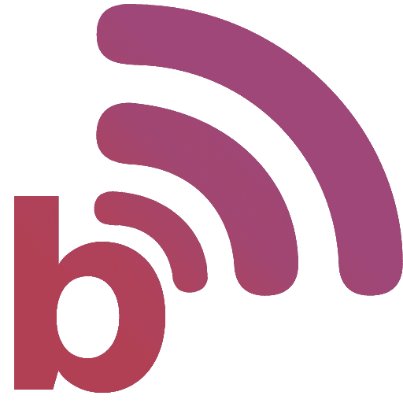

# Blog

This is the repo of my personal blog powered by 11ty. You can access it under https://blog.davidmoll.net or via RSS at https://blog.davidmoll.net/feed.xml
*The website is currently WIP and not being hosted externally. If the website is not accessible I am not actively working on it for the moment*

## How It Works

1. Each article gets written in Markdown
2. 11ty converts all files into HTML upon launch of the project into a folder called `_site`
3. The website is accessible from my server via Cloudflare Tunnel 

## Patch Notes

**Version 1.0.1**
- Added lighthouse scores to stats

**Version 1.0.0**
- Moved hosting to Raspberry Pi 4B

**Version 0.2.1**
- Added support for footnotes
- Added support for anchors
- Added collapsible metadata-table for each blog-post
- Added size of build to stats

**Version 0.2.0**
- Added tags and tags-collection
- Modularized code
- Added filesize-info per post

**Version 0.1.0**
- Added comments
- Made website dark-mode by default

**Version 0.0.2**
- Added icons
- Added support for Open Graph
- Cleaned up templates
- Minimized images and build code

**Version 0.0.1**
- Added index
- Added about-me
- Added archive
- Added first articles

## Roadmap
- Full coverage of WCAG 2.2 and eventually WCAG 3.0
- Better design
- Improved hosting similar to [LOW←TECH MAGAZINE](https://solar.lowtechmagazine.com/about/the-solar-website/)

## Icons

All icons were generated with [RealFaviconGenerator](https://realfavicongenerator.net/) [v0.16](https://realfavicongenerator.net/change_log#v0.16)

## Installation

- Clone this repo with `git clone https://github.com/akashic101/blog`
- Navigate into this repo with `cd blog`
- Install all dependencies with `npm install`
- Build the site with `npx @11ty/eleventy`
- Navigate to http://localhost:8080 to see the website
