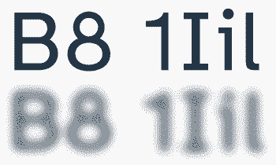

I have been wanting to create my own blog for a while. Inspired by other creators such as Jeff Geerling, LOW←TECH MAGAZINE, Pluralistic and others just to name a few I thought how difficult can it be to create your own. 

*The answer is not so much as it turns out*

Before even starting this project I had a few things in mind that this blog should have:

- The blog in general
- Alternative Web-Feeds
- 100% Accessibility
- Low footprint and easy to run

Let's see how I am solving each problem or how I plan to tackle them:

## The blog in general

While I am slowly loosing my imposter-syndrome -at least for now- with frontend-development I wanted to try something different with this blog. My first instinct was to use React since that is what I am most comfortable with, but after a bit of thinking I realized that I do not need a dynamic behemoth that a React-project would end up as. After a bit of research I chose 11ty as my Static-Site-Generator of choice for a few reasons:

### Flexibility
11ty allows me to use a multitude of ways to write and format my articles. I could write my articles in

- HTML
- Markdown
- WebC
- Javascript
- Nunjucks
- Liquid
- Handlebars
- EJS
- HAML
- Pug
- [And even more](https://www.11ty.dev/docs/languages/custom/)

In the end I decided to use good-old Markdown for its simplicity, easy readability and usability

### No Magic

11ty is from the get-go exactly what I want a piece of software to be. It does not track you. It does not send user-information. It puts performance over looks (no hydration unless you want it to, no dynamic websites, WYSIWYG) and it just works. You don't even need any config to get a website going

### Performance

11ty is since its "only" generating static websites fast by default. But even with that in mind compared to other site-generators its very often at the top of the charts

| Name         | Building ×4000 Markdown Files |
| ------------ | ----------------------------- |
| Hugo         | 0.68s                         |
| **Eleventy** | **1.93s**                     |
| Astro        | 22.90s                        |
| Gatsby       | 29.05s                        |
| Next.js      | 70.65s                        |
*Data taken from: [11ty Performance](https://www.11ty.dev/docs/performance/)*

While I will probably never write >4000 articles in my life it still is nice to know that I do not have to wait for any unnecessary time. 11ty also has the added benefit that I barely had to do anything to get all 400 points in Lighthouse. The only thing I had to add was the meta-description since that is not added by default when creating a HTML-template using emmet in VS Code.

## Alternative Web-Feeds
Call me old-school, but RSS-feeds are a great piece of technology that too many websites choose to eliminate, or flat-out not include from the start. For a company it makes sense. You cannot track the user, you cannot show any third-party ads and the user doesn't even enter your website to be able to navigate to other articles. I however am in the lucky position that none of those things are something that I have to be concerned about. I am running this blog at a loss and I am fine with that. Not everything has to be min-maxed or be turned into profit.
Luckily 11ty has a plugin for [Alternative Web-Feeds](https://www.11ty.dev/docs/plugins/rss/) that is pretty straight-foward to set up. All you need are three steps -install, import, template- and you have a fully functional RSS/Atom-Feed for your blog. Keep in mind that this works by using the tags you give posts, so make sure that is all working, I stumbled over this part for a while: [Collections (Using Tags)](https://www.11ty.dev/docs/collections)
You can add the RSS-Feed to your reader with the following link: [https://blog.davidmoll.net/feed.xml](/feed.xml). Also if you are looking for a good RSS feed reader on Android I heavily recommend [Feeder](https://f-droid.org/en/packages/com.nononsenseapps.feeder/) on F-Droid

## 100% Accessibility

I volunteered this year at the Special Olympics World Games Berlin -which will definitly be more explored in an own article- and it showed me two things:

- How important accessibility is in the web for people with disabilities
- How very little basically all websites care about providing said accessibility

There are multiple things that make a website truly accessible. From things like the font used, size of components, contrast from text to background to properly labeling parts of websites to make them usable with a screen-reader, so many things can be done and yet so little things are implemented in the final product. This is one of the reasons why RSS-feeds are so important since their layout is always the same with no distractions surrounding the important bits. Google itself provided a product called Google Reader for such feeds before promptly, but per usual, killing it in 2013 after running it for eight years. [The stuff that Google has done to bring RSS under the ground goes on and on and on....](https://openrss.org/blog/how-google-helped-destroy-adoption-of-rss-feeds)
With this website I want to do better, and I am not stopping at 400 Lighthouse points, though its a nice start:

### WCAG

[The Web Content Accessibility Guidelines](https://www.w3.org/WAI/standards-guidelines/wcag) define guidelines that websites should follow to make them more accessible to people with disabilities. Currently I am learning on how to follow all [four principles](https://www.w3.org/WAI/WCAG21/Understanding/intro#understanding-the-four-principles-of-accessibility) defined by the guidelines and the goal is to make this website 100% compatible with not only WCAG 2.2, but also the work-in-progress 3.0. Anything less I deem unaccabtable for this project.

### Font

You might have noticed that this website is not using a font such as Segoe UI, Arial, Times new Roman or similar. Instead I opted to use a font called [Atkinson Hyperlegible](https://brailleinstitute.org/freefont)

The font was created by the Braille Institute who were planning a rebranding of their concept who then in turn contracted the studio Applied Design Work to work on this new font they wanted to use. Most students that the Braille Institute works with are not fully blind and do not use the tactile writing system with which the institute shares a name. This means that a lot of people have problems using more popular fonts such as Times New Roman but also don't have a need enough to use braille. This font makes sure that no glyph for any character can be confused for another one improving readability even for people with vision-impairment.

*The font's normal appearance above, and a blur effect simulating how the same letters might appear to someone with a low-vision condition below.*

## Low footprint and easy to run

This website was hugely inspired by LOW←TECH MAGAZINE who are powering all their websites by solar. If the battery is empty then the website is down, thats it. You can read more about how they achieve this task by reading [this article](https://solar.lowtechmagazine.com/2020/01/how-sustainable-is-a-solar-powered-website) on their (hopefully online) website.

Similar to LOW←TECH MAGAZINE's solution I want to keep a small footprint and run this website on the bare minimum needed. My current plan is to run this website on a Raspberry Pi Zero W connected to the back of my router, though I haven't gotten that far yet to test this. If the Zero W is not powerful enough I have a Pi 3 and Pi 4 that are gathering dust which I could also use to power this blog. As for how to open this website to the web, I am using [Cloudflare Tunnel](https://www.cloudflare.com/products/tunnel) though I am looking for a better option that does not require the help of another company. Selfhost all the way.

Eventuell I do want to run on solar and battery as well but that is far into the future, though if I do manage it I will make sure to share my way to that achievement here as well.

---

Now that I covered how I am planning to run this blog I want to extend on what content I will share here:

*I don't know yet*

I will share here whatever is on my mind, jumping from topic to topic. There will almost never be articles released after each over covering the same topic or even the same area. I will share links I find interesting, talk about my projects, my hobbies or just interests, my work, my life, my cats, whatever is on my mind.

I think this is enough for my very first post. Let's see what I come up with next. Thank you for reading if you got this far, and if you didn't, I cannot blame you