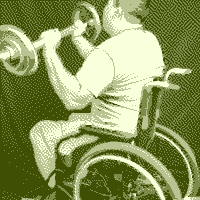

The Special Olympics are an event similar to the Olympics and Paralympics but only specifically for people with mental disabilities. Despite sharing a name with those two events they are not organized by the International Olympics Committee (IOC) but instead the movement was founded in 1968 by Eunice Kennedy-Shriver, a sister of US President John F. Kennedy. In this blog I want to talk about my experience volunteering at the Special Olympics World Games Berlin 2023.

## The way to the games

I don't specifically remember anymore where I first heard that the Special Olmpyics is looking for volunteers but I knew that I very quickly decided that I want to take part in the event as a volunteer. Signing up as a volunteer was very easy, you fill out a few forms with information about yourself, which languages you speak, if you have any experience working and assisting people with mental disabilities, if you have any physical and/or mental disabilities yourself and which area of the event you can see yourself helping out at. After sending that off the waiting begins where the organizers have a look at all the volunteers that signed up and see where they can help out the best. With 7.000 athletes and 300.000 visitors they asked for 20.000 volunteers for the entire event, so any help was greatly appreciated. 

On the 16th November 2022 I got the reply that my application has been accepted, but it wasn't at this point yet decided which kind of work I will do. 

A few weeks later on the 3rd Dezember I got another mail with informations about how I can request special leave from my work, meaning I won't be paid for the week I won't work but it also won't be deducted from my holidays of the year. My boss already knew that I signed up for the event and got accepted and it was already planned in that I won't be working for the week so all that got cleared very quickly as well.

After this I didn't hear anything for almost three months but I spend the time using the supplied material by the Special Olympics to learn more about the event, the work with the athletes and about the upcoming games in Berlin.

On the 16th March 2023 I got the information about the work I have been tasked with. I was initially tasked with helping and assisting the VIP's at the Berlin Airport but that wasn't the work I was really interested in. Luckily everyone has the chance to ask for another role which I took, and a week later I got my new role:

**Sponsoring & Photography Support Volunteer**

As a Sponsoring & Photography Support Volunteer, I am part of the sponsoring and fundraising team and support the Special Olympics in all matters relating to our partners (sponsors). I will mainly guide our partners through the venues and provide them with all the necessary information on site. I will also support the Special Olympics at the reception for all the partners, ambassadors and sponsors. Last but not least, I will help with the selection of photos and videos showing the partners on site, at their activation stands and during workshops.

I was also at this point able to put in the shifts I want to volunteer at. The event took officially place from the 17th to the 25th June 2023 but they were also looking for asistance weeks before and after the event. Since my role was only necessary during the event and I wanted to see as much as possible from the event I signed up for every single day.

Two months later I got not only my tickets for the opening ceremony (all volunteers get free access to the opening- and closing-ceremony) but also the specific training for my role. This training included things like:

- Who are the sponsors
- Durations of shifts (normally from 9-18 with a 1 hour break)
- Where my shifts start

At this point the Special Olympics where only a month away and we continued to get some more informations. I met some of my colleagues and volunteers in a zoom-call, a WhatsApp group-chat was created (initially it was planned to use Telegram but due to technical difficulties it was decided to switch to WhatsApp) and we also got the option to sign up for more shifts, but since I already had one on every day this wasn't something I had to bother with. 

With the event nearing its beginning I drove to Berlin and only arrived 40 minutes later than planned which must have been a new record for Deutsche Bahn. I was fortunate to have some family in Berlin which allowed me to stay at their place for the week, but I also had the option to stay on-site at the Special Olympics which organized a hall for volunteers to stay in who were not able to find a hotel or place to stay at. The very last thing to do before the first day was to get my accreditation and uniform. Each volunteer got a bag with a shirt, a hoodie and some small things like drinking-bottle, a booklet about the event, a cup, stickers and pins. All of this was done in the Uniform Distribution & Accrediation Center (UDAC) which fortunately was just a few minutes away from the Multi-Media Center (MMC) which was my main place of work.

With all of that done it was finally time to start the event:

## The Special Olympics

### Day 0

