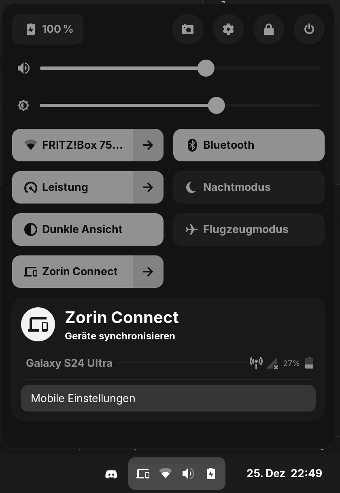
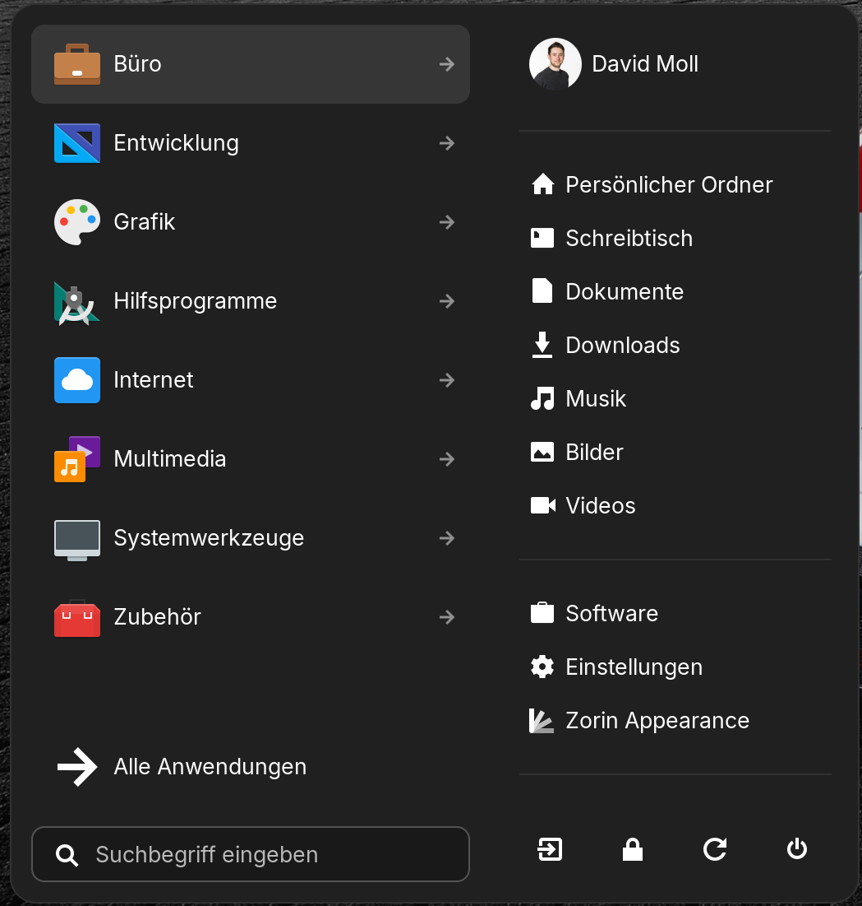
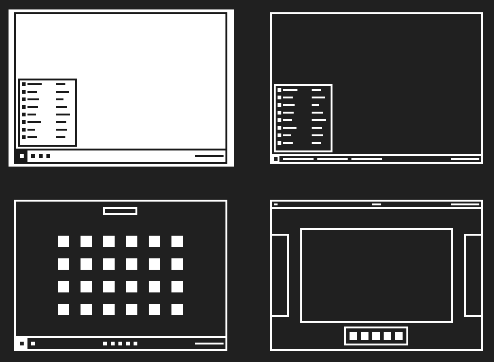

## Opening

The year is almost over and so is my first year with working on linux. While I started the year with good ol' Windows 10 I quickly was forced to switch to Linux since multiple tools of the techstack used in the project work so much better on anything that isn't Microsoft. With the personal beef I have with Apple I quickly made the choice to switch to Ubuntu which in 2024 also had a major release to LTS 24.04. And while my experience with Ubuntu has been really really great I still wanted to switch things up a little bit. After doing some research (thanks for so many great articles [It's FOSS](https://news.itsfoss.com/)) I made the decision to switch to [Zorin OS](https://zorin.com/os/) and in this blog I will talk about my experience in the first month.

## Installation

Zorin OS was very easy to install. With the latest version of the OS (17.2) beeing based on Ubuntu LTS 22.04 (more on that later) all it took was a USB-stick, Etcher and a few minutes of my time. Zorin offers the typical try-before-install Live OS which allows me to try it out after burning the image onto a USB-stick. There it already shows that Zorin still has lots of similarities with Ubuntu under the hood but with a fresh coat of paint and some new features. Everything felt as welcoming and easy to get used to as Ubuntu so the install was quickly done and I was off to the races.

## First few minutes

First on the agenda was installing the typical programs I need for work, those beeing VS Code, Slack, Teams and Firefox. Similar to Ubuntu I was quickly able to install most of them from the Software-Store. Here I also made the decision to test out a new Email-client called Betterbird, a new fork from Thunderbird which recently has gained a bit in popularity. The biggest problem there was getting my calender synced up but this was easily solved with [TbSync](https://addons.thunderbird.net/en-us/thunderbird/addon/tbsync/) and [Provider for Exchange ActiveSync](https://addons.thunderbird.net/en-us/thunderbird/addon/eas-4-tbsync/) which automatically import and sync all my calenders. 

The biggest problem was, not to any surprise to be honest, Teams. Microsoft did release a native version (native meaning the website in an Electron-wrapper) in 2019 but discontinued it just three years later in 2022. The following PWA was, is and always be a complete mess which I would bet money on Microsoft will never really be bothered enough to properly fix. The best version I was able to find is [teams-for-linux](https://github.com/IsmaelMartinez/teams-for-linux) which works well enough but is also not perfect due to Microsoft putting roadblocks into the way.

Small rant aside, bringing all applications I used from Ubuntu to Zorin was a nice and easy experience with barely any problems. With both having the same underlying code this shouldn't be too much of a surprise but it is still nice to see that everything is working as intended.

## Why is my right-click not working?

The first issue I encountered was that my trackpad on my laptop did not behave correcty. While a normal left-click was no issue by double-clicking the bottom left of the touchpad the same cannot be said for trying the same with a right-click. After looking around a little bit I found a setting which in my personal opinion does not has a correct default-value. If you go in the settings to "Mouse and touchpad" -> "Touchpad Click Options" you will notice that by default the behaviour is set to "Right-Click with Two Finger Click or Two Finger Tap" instead of "Right-Click with Click in Bottom Right Corner or Two Finger Tap". Changing this to the later resulted into the expected behaviour.

Another thing that can be noted here is that the German translation for Zorin is not complete. The settings are a wide mix between German and English with no real explanation given why some are one language and others are not. My assumption would be that new features are not translated yet but a look at the [Zorin-translation-page](https://translations.zorin.com/) shows that that string isn't even a string that can be translated. I completely understand that getting all the translations done by the developer-team is basically impossible and the community will gladly fill in the gaps but at least all strings should be able to be translated.

## A closer look at Zorins features

So what does Zorin actually offer on top of Ubuntu? For once a very pretty and modern design. With less rounded corners and a more readable stand-out font the whole system looks very sleak, clean and modern.

You may have also spotted something called "Zorin Connect" in the quick-settings. This little app is a fork from KDE connect that allows you to share files, control both devices and get notifications on your phone and PC. However when I say its a fork from KDE connect then I am beeing generous about this. As far as I can tell it's just a reskin with not a single added feature on top of it. In fact when I install KDE connect on my laptop it allows me to connect it to the Zorin Connect App on my phone. The Zorin Connect App looks 1:1 like the KDE Connect App with just some changed names and that's it. I would go as far as to call this a gimmick, not a feature and this seems to be a trend with this distro.

One big feature that Zorin proudly presents on their website is the 3d-screen rotation. If you enable this which Zorin directly asks you after installing the distro you can change your desktop in 3d-space, showing all applications physically above each other, giving a overview of where each window is.

This admittedly was nice and fun to try out but I disabled it again after a few minutes. Same goes for the jelly animation which transform the window when dragging it giving it a, you guessed it, jelly-like appearence. Nice to try out, quickly disabled again. The only real feature that is actually useful in my own opinion is the ability to set different screen-layouts, making the transition from other operating-systems a lot easier. Zorin supports out of the box four different layouts that copy the feeling of Windows-like, Touch layout, Windows List-like and GNOME Shell-like.

However there is a way to get even more layouts that copy layouts from macOs, Windows 11, ChromeOS or Ubuntu. And this is where another problem shows up that is very prominent with Zorin

## Zorin Pro

There are three versions of Zorin that you can download. Zorin Core, Zorin Education and Zorin Pro. Let's go through the differences in those distros.

Core is the base version which is free and what I am personally using right now. The Education-version takes away <s>KDE</s> Zorin Connect and instead adds some applications like Scratch, GDevelop, Fritzing, Builder and LibreCAD. Those applications are a nice addition, especially for the younger or inexperienced community that is looking for a paved road into the world of technology. And while they all come free it saves a lot of time that they all come preinstalled and working out of the box with no additional work needed to be done.

Now the third version is where the problems start. Zorin Pro costs at the time of writing 47,99€ as a one-time payment. For that you get the before-mentioned additional desktop-layouts (six on top of the already included four), a preinstalled "professional-grade creative suite of apps" and "advanced productivity tools". Oh and of course the additional artwork you can use for your desktop-background. But here is where the problem lies. All of those apps, as far as I can tell, are just free apps that you can download yourself. And Zorin knows that which is why they do not have the apps that you actually get listed anywhere, just that they include alternatives to other paid applications in other operating-systems. Through various videos, articles and screenshots I was able to collect following list of applications that come preinstalled in the pro-version and the program they replace according to Zorin's website:

| Program                   | Alternative to |
| ---------------------- | --------- |
| Program               | Alternative to |
| Blender               | Autodesk Maya |
| Darktable | AfterShot Pro    |
| GIMP               | Adobe Photoshop     |
| Inkscape       | Affinity Designer     |
| Krita   | Procreate    |
| LibreCAD     | Autodesk AutoCAD     |
| LibreOffice     | Microsoft Office Suit    |
| Scribus     | Affinity Publisher   |
| Minder     | iThoughts    |
| Denaro     | GreenBooks    |
| Planify, Xournal++    |   Things  |
| Ardour 8, Audacity   |   FL Studio  |
| Handbrake   |   Adobe Media Encoder  |
| KdenLive   |   Adobe Premiere Pro  |
| Mixxx   |   Traktor Pro |
| OBS Studio   |   |
| VirtualBox   |   |
| Foliate     |     |
| Feeds     |     |
| OpenToonz     |      |

Now the first thought for many readers would be "oh wow, the developers are so slimy, they want money for software I can easily download myself, how dare they?". And with a "pro"-edition this thought isn't crazy to think considering you pay a lot of money for free software. But that is not why the developers want you to buy this version of the OS. This version exists as a thank-you to the developers, a way of supporting them and the hard work they do. They went through all of the work of testing all of those applications and making sure they work with no issues at all which is for linux not always given. But they named it pro, and thats where the real issue lies. In my personal opinion the version should carry a different name, something like "support-version" or "licensed version". Immich, a very popular selfhosted alternative to Google Photos went through [exactly the same problem this year](https://www.reddit.com/r/selfhosted/comments/1e6hsn4/immich_introduces_licensing_options_to_support/) and they solved it the same way, [renaming the paid version and clarifiyng what you get](https://www.reddit.com/r/selfhosted/comments/1ea8iim/wording_change_and_clarification_for_purchasing/). This is in no way hate towards the developers but right now the only real feature you get are six different screen-layouts and a bit of saved time which does not deserve the pro-name. Also please add the list of pre-installed software, hiding that to make the user think he gets the deal of a lifetime for a bundle of free software is plainly not ok.
